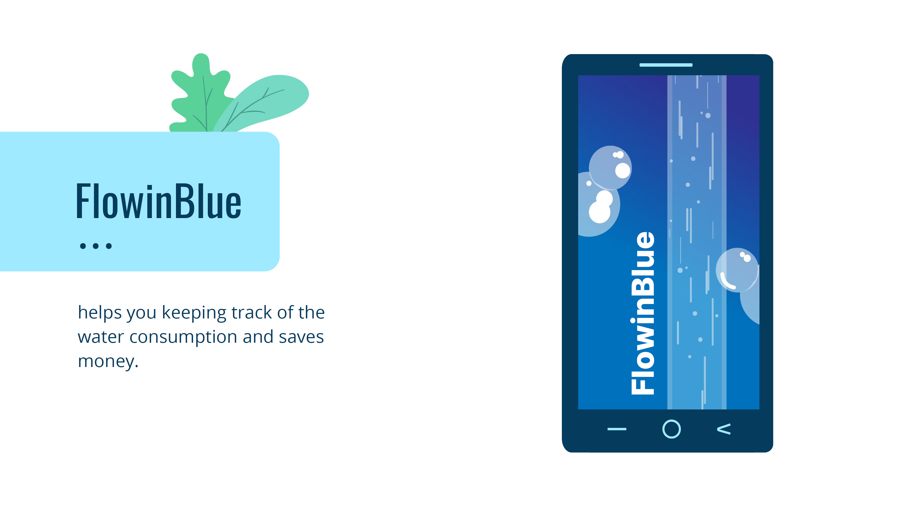

# FlowingBlue
A project created in 36 hours for the HackaTUM Hackathon.

## Created By
- Mohamed Dhia Nouri: [@theKooker](https://github.com/theKooker)
- Dylan Alyandi: [@WoodRawr](https://github.com/WoodRawr)
- Alexander Hofmann: [@alexhofmanndev](https://github.com/alexhofmanndev)
- Paul Köhler: [@gam3boy03](https://github.com/gam3boy03)

## Our Question
How much energy do you use with your daily bathroom routine? Especially showering, which probably takes most of the time you spend there.

## The facts
The energy it takes to heat the water for a warm one minute shower is enough to charge your smartphone up to 20 times.

## Our solution
We created an App, that enables you to lower your water and energy consumption in the bathroom. By playing a game and sharing with your friends

## What it does?
You just start a timer and our app tracks how long you have been showering and it estimates the amount of power and water you used. Also there is a Ranking to battle your friends who is able to get the shortest times.

## Accomplishments that we are proud of
We are really happy that we were able to create an awesome UI and got a prototype done for a signal analysis, which would enable us to create a ML model using more data to more accurately measure the amount of time you took in the shower.

## How we built it?
We used Flutter and Firebase to create the app. The signal analysis was done in MATLAB and converted down into C to integrate it in the App. Also we created our assets in Adobe Illustrator.

## Challenges we ran into
Not enough data lead us to overfit our model to one specific recording, which turned out to be a problem, due to the specifics every smartphone and enviornment pose. 

## Whats next?
We want to integrate the Machine Learning model fully, get our App on more devices and make the app more usable. Also we would love to integrate into more spaces of living, where water consumption plays a big role, like in groceries and shopping.

## Pitch Slides:
[here](/pitch_slides.pdf)